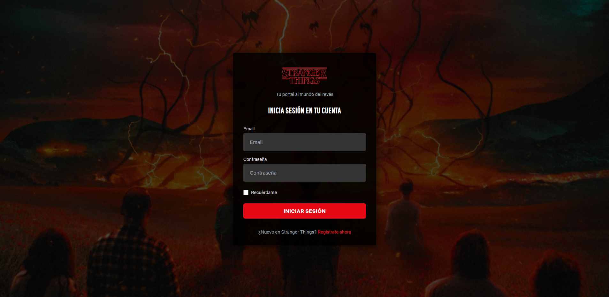
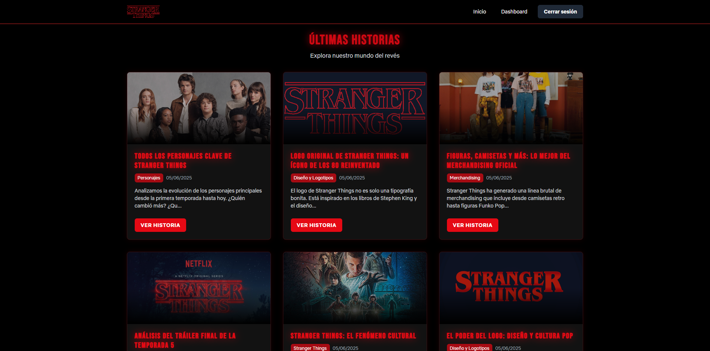
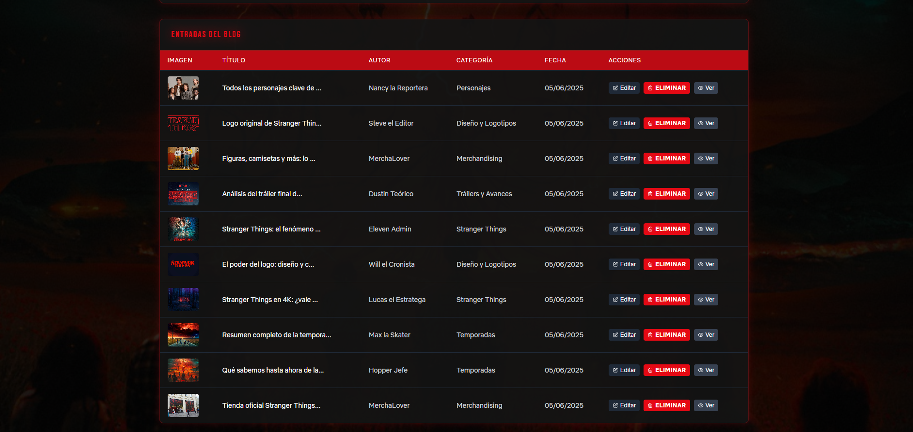

# 🔮 Stranger Things Blog

<p align="center">
  
</p>

<p align="center">
  
  
  
</p>

<p align="center">Un portal al Mundo del Revés - Blog temático sobre la serie Stranger Things con dashboard administrativo para gestión de contenidos.</p>

## 📺 Vista previa

### ⚡️ Inicio y Login
Una experiencia de login oscura y temática con el estilo característico de la serie.

<div align="center">  
    
</div>

### 📓️ Blog
Visualización atractiva de las entradas del blog con diseño inspirado en Stranger Things.

<div align="center">  
    
</div>

### ⚙️ Dashboard de Administración
Panel de administración completo para la gestión de contenido.

<div align="center">  
    
</div>

## 💾 Características principales

- 👤 **Sistema de usuarios** con diferentes roles (administrador y usuario estándar)
- 📝 **CRUD completo** para entradas del blog
- 🖼️ **Gestión de imágenes** para las entradas
- 🔍 **Visualización detallada** de entradas individuales
- 💡 **Interfaz temática** inspirada en Stranger Things
- 📱 **Diseño responsive** que se adapta a diferentes dispositivos
- 🌐 **Categorías** para organizar mejor el contenido
- 🔒 **Autenticación segura** con contraseñas hash
- 💻 **Panel administrativo** intuitivo

## 📍 Tecnologías utilizadas

- **Backend**: PHP 8.0+, POO, MySQL
- **Frontend**: HTML5, CSS3, JavaScript
- **Framework CSS**: TailwindCSS 2.2.19
- **Fuentes**: Bebas Neue, Netflix Sans, Benguiat Bold (Fuente de Stranger Things)
- **Servidor**: Apache (XAMPP)
- **Sistema de control de versiones**: Git

## 📚 Prerrequisitos

- PHP 8.0+
- MySQL 8.0+
- Servidor web (Apache recomendado)
- XAMPP/LAMP/MAMP o similar

## 💲 Instalación

1. **Clonar el repositorio**
   ```bash
   git clone https://github.com/TuUsuario/StrangerThingsBlog.git
   ```

2. **Crear la base de datos**
   - Importa el archivo `db/stranger_things_blog.sql` en tu servidor MySQL

3. **Configurar la conexión**
   - Edita el archivo `db/conexionDatabase.php` con tus credenciales:

   ```php
   private $host = "localhost"; 
   private $db_name = "stranger_things_blog";
   private $username = "tu_usuario";
   private $password = "tu_contraseña";
   ```

4. **Configurar permisos**
   - Asegúrate de que la carpeta `descargaImagenes` tenga permisos de escritura:
   ```bash
   chmod 755 descargaImagenes
   ```

5. **Acceder al sitio**
   - Visita `http://localhost/StrangerThingsBlog/` en tu navegador

## 📟️ Estructura de la base de datos

### Tablas principales:

- **usuarios**: Almacena los datos de los usuarios del sistema
- **entradas**: Entradas del blog con contenido, categoría, autor e imagen
- **categorias**: Clasificaciones para las entradas

## 💬 Acceso de prueba

- **Administrador**:
  - Email: admin@blog.com
  - Contraseña: 1234

- **Usuario estándar**:
  - Email: franmorales@eag.com
  - Contraseña: 1234

## 💥 Licencia

Este proyecto está bajo la licencia MIT. Ver el archivo [LICENSE](LICENSE) para más detalles.

## ❤️ Créditos

- Diseño inspirado en la serie Stranger Things de Netflix
- Iconos por [Heroicons](https://heroicons.com/)
- Imágenes de la serie Stranger Things utilizadas únicamente con fines educativos

---

<p align="center">
  
  <br>
  <i>El mundo del revés está más cerca de lo que crees...</i>
</p>
